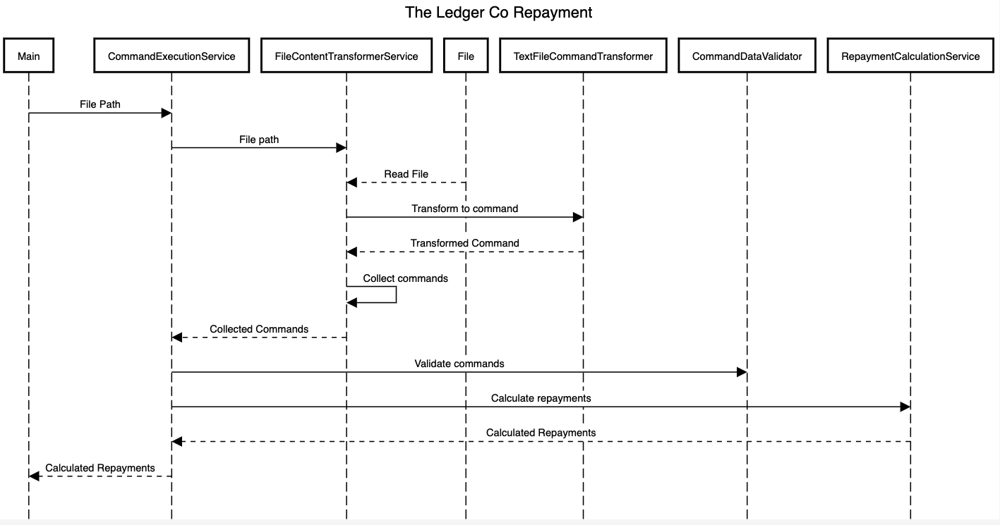

<h3>Introduction</h3>
Application is about reading transaction made by borrowers to the bank in relations to their loans and calculating amount payed so far and 
remaining number of payments.
The inputs a fed by an text file and the application reads the file to identify the <i>Loan, Payments and Balance</i>.

<h3>Sequence Diagram</h3>

<h3>Assumptions</h3>
<ul>
<li>Transactions in the file needs to be in the order of their emi for a particular bank and borrower.</li>
</ul>

<h3>Build</h3>
<code>mvn clean install -DskipTests -q assembly:single</code>

<h3>Run test</h3>
<code>mvn clean test</code>

<h3>Test Coverage</h3>
<code>mvn jacoco:report</code>

<h4>Path</h4>
<code>geektrust-problems/target/site/jacoco/index.html</code>

